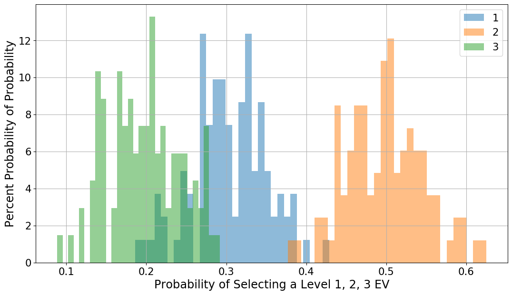
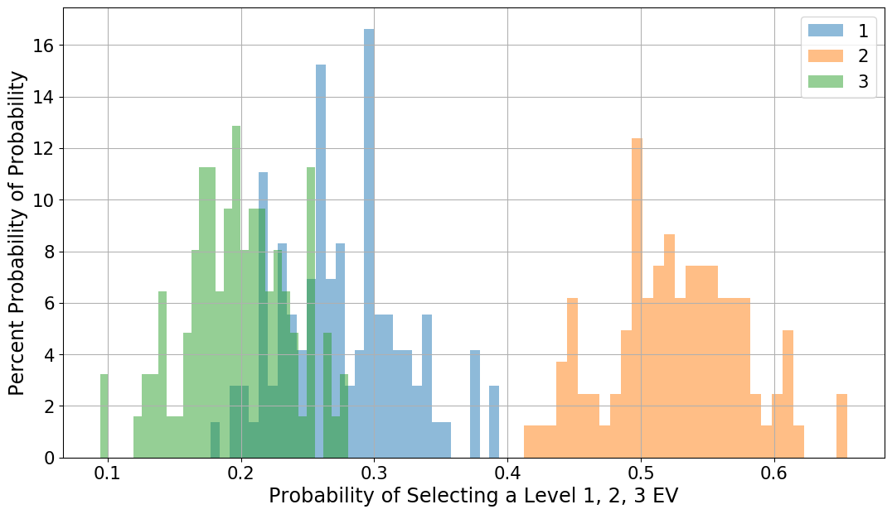

# Monte Carlo Simulation using Merlin

This tutorial will walk through how to setup a HELICS Monte Carlo simulation
using Merlin. We assume that you have already completed the
[**orchestration tutorial**](orchestration.md) and have some
familiarity with how Merlin works.

We will walk through how to user Merlin to setup and run a Monte Carlo simulation using HELICS. Code for the Monte Carlo simulation and the
full Merlin spec and be found in the [**User Guide Examples**](https://github.com/GMLC-TDC/HELICS/tree/v3userguide/examples/user_guide_examples/) under [**Example 3**](https://github.com/GMLC-TDC/HELICS/tree/v3userguide/examples/user_guide_examples/Example_3).

# Monte Carlo Cosimulation

A Monte Carlo simulation allows the practitioner to sample random numbers repeatedly from a predefined distribution to explore and quantify uncertainty in their analysis. Additional detail about Monte Carlo methods can be found on [Wikipedia](https://en.wikipedia.org/wiki/Monte_Carlo_method) and [MIT Open Courses](https://www.youtube.com/watch?v=OgO1gpXSUzU).

In a Monte Carlo Cosimulation, a probability distribution of possible values can be   used in the place of any static value in any of the simulators. For example, a cosimulation may consist of a simulator (federate) which measures the voltage across a distribution transformer. We can quantify measurement error by replacing the deterministic (static) value of the measurement with a random value from a uniform distribution. Probabilistic distributions are typically described with the following notation:

$$ M \sim U(a,b) $$

Where $M$ is the measured voltage, $a$ is the lower bound for possible values, and $b$ is the upper bound for possible values. This is read as, "$M$
 is distributed uniformly with bounds $a$ and $b$." 
 
 

The uniform distribution is among the most simple of probability distributions. Additional resources on probability and statistics are plentiful; [Statistical Rethinking](https://xcelab.net/rm/statistical-rethinking/) is highly recommended.

## Monte Carlo Cosim Example: EV Garage Charging

The example cosimulation to demonstrate Monte Carlo distribution sampling is that of an electric vehicle (EV) charging hub. Imagine a parking garage that only serves EVs, has a static number of charging ports, and always has an EV connected to a charging port. An electrical engineer planning to upgrade the distribution transformer prior to building the garage may ask the question, "What is the likely power draw that EVs will demand?"

*Likely* is synonymous for *probability*. As we are interested in a probability, we cannot rely on a deterministic framework for modeling the power draw from EVs. I.e., we cannot assume that we know a priori the exact demand for Level 1, Level 2, and Level 3 chargers in the garage. A deterministic assumption would be equivalent to stating, e.g., that 30% of customers will need Level 1 charge ports, 50% will need Level 2, and 20% will need Level 3. What if, instead of static proportions, we assign a distribution to the need for each level of charge port. The number of each level port is discrete (there can't be 0.23 charge ports), and we want the number to be positive (no negative charge ports), so we will use the [Poisson distribution](https://en.wikipedia.org/wiki/Poisson_distribution). The Poisson distribution is a function of the anticipated average of the value $\lambda$ and the number of samples $k$. Then we can write the distribution for the number of chargers in each level, $L$, as

 $$ L \sim P(k,\lambda) $$

Let's extend our original assumption that the distribution of chargers is static to Poisson distributed, and let's assume that there are 100 total charging ports:

 $$ L1 \sim P(100,0.3) $$
 $$ L2 \sim P(100,0.5) $$
 $$ L3 \sim P(100,0.2) $$
 
  
 
 What if we weren't entirely certain that the average values for $L1, L2, L3$ are $0.3, 0.5, 0.2$, we can also sample the averages from a normal distribution centered on these values with reasonable standard deviations. We can say that:
 
 $$ \lambda \sim N(\mu,\sigma) $$
 
 Which means that the input to $L$ is distributed normally with average $\mu$ and standard deviation $\sigma$.
 
 Our final distribution for modeling the anticipated need for each level of charging port in our $k = 100$ EV garage can be written as:
 
 $$ L \sim P(k,\lambda) $$
 $$ \lambda \sim N(\mu,\sigma)  $$
 
<center>

|			  | $L1$   |      $L2$      |  $L3$ |
|----------|:----------|:-------------:|------:|
| $\mu$ |  0.3|  0.5 | 0.2|
| $\sigma$ |  $\sim N(1,3)$ |    $\sim N(1,2)$   |   $\sim N(0.050.25)$ |

</center>

  
 
# Merlin spec for Cosimulation
In this specification we will be using the
[helics_cli](https://github.com/GMLC-TDC/helics-cli) to execute each
cosimulation run since this is a Monte Carlo simulation. This means
that helics\_cli will be executed multiple times with different
helics_cli runner files. 

## Helics_cli in Merlin

Since we are using the helics\_cli to manage and execute all the
federates, we need to create these runner files for helics_cli.
There is a provided python script called `make_samples.py` that will
generate the runner file and a csv file that will be used in the
study step.

An example of how the helics_cli runner file looks like is shown
below.

```
Example of helics_cli runner for UQ EV example
```

As you can see from the example there are 3 federates 1 for the
EVMsgFed.py, 1 for the EVControllerMsgFed.py and 1 for the HELICS
broker. Helics\_cli will start each of these federates. In the Merlin
spec, Merlin will be instructed to execute the helics\_cli with all the
generated helics\_cli runner files.

## Merlin Specification

In the Merlin spec we will instruct Merlin to execute N number of the
Monte Carlo co-simulations. The number of samples is the number
specified as the `N_SAMPLES` env variable in the env section of the
merlin spec.

```
env:
  variables:
    OUTPUT_PATH: ./UQ_EV_Study
    N_SAMPLES: 10	
```

We set the ouput directory to UQ_EV_Study, this is where all the
output files will be stored.


